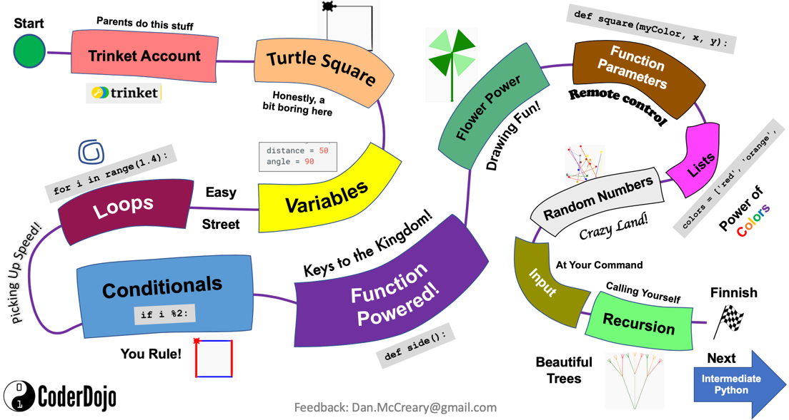

# Dan McCreary's STEM Resources

## CoderDojoTC Python Website

[CoderDojo Twin Cities Python Microsite](https://www.coderdojotc.org/python/)

This website contains lessons for students who are just begging to learn to program with Python.  Python has been our most popular language.  We are always looking for Python Mentors who can volunteer to work with girls and disadvantaged youth in these programs.  Most of the lessons run on the kid-save Trinket.com website.  We are most proud of our Journey Map which helps students get oriented on their Python journey.

Note that when we start, students are shown this map.  If they reach the end (not the finish flag) they they get a cool Python sticker.

## CoderDojoTC MicroPython

[MicroPython Website](https://www.coderdojotc.org/micropython/)

This website contains a huge number of lessons for students to learn physical computing with Python.  We put a focus on the Raspberry Pi Pico and we converted most of our 200+ legacy Arduino labs written in C to use MicroPython.  
This site has hundreds of sample lesson plans and projects as well as extensive documentation
on various kits such as a $19 collision avoidance robot using the RP2040 processor.
Please let me know if you can help contribute sample programs.

As of March of 2023, this site became our most popular site with over five thousand page views each month
from students, teachers and mentors around the world!
Every month we are getting more and more page views and we continue to add new content.

This map shows the number of page views by country in 2023.

## MicroSims

## Moving Rainbow

[Moving Rainbow Website](http://dmccreary.github.io/moving-rainbow)

How much computational thinking can we teach using a $4 microcontroller and a $3 LED strip?  It turns
out the answer is "a lot!".  This website has many examples of learning how to program
Python using really fun bright LED strips.  We can use them as the basis for LED costumes,
wall decorations, night lights, clocks, signs and many more projects.

Although some of the content is a duplicate of the NeoPixel labs on the MicroPython site, we have placed
all the relevant examples and added new detailed content for a class where every participant has these
kits.  This $7 kit and this website has also been used for our Halloween costume [IoT Hackday](https://www.coderdojotc.org/iot-hackday/) and other special events.  This also means we have many mentors who are already familiar with these kits.

## Robot Faces

[Robot Faces Website](https://dmccreary.github.io/robot-faces)

With the advent of low-cost and bright OLED displays, our students have wanted to add "faces" to our robots
that show expressions like happiness, surprise, sleepiness, etc.  These labs use the new MicroPython
ellipse and poly functions introduced in 2023 to make drawing even complex shapes like eyebrows possible.

## Generative AI For Teachers

[Generative AI For Teachers Website](http://www.coderdojotc.org/chatgpt-for-teachers/)

This website was originally started to help teachers use Generative AI to help 
automate time-consuming tasks such as generating customized lesson plans for
students.  It has grown to include a rich library of simulations for helping
instructors demonstrate concepts.  The site also includes a link to the video
of our presentation.

## Clocks and Watches

[MicroPython Clocks and Watches Website](https://dmccreary.github.io/micropython-watch/)

This is our latest project that takes advantage of the new color Smart Watch displays.  Although
the displays cost only around $7 each, they offer bright colors on a 240-240 circular display.
You can program your own digital and analog watch faces as well as build clocks that
synronize with the time servers for accurate time.  They can even be used
to display the current temperature, weather forecast and phases of the moon.

## TED-X Youth Video

[Can we use artificial intelligence to improve education?](https://www.youtube.com/watch?v=-ySgwSWCeqs)

In this talk, Dan McCreary shares his take on the question "Can we use artificial intelligence to improve education?" From the 84 billion neurons in human brains to the Netflix suggestion algorithm, Dan McCreary exemplifies the benefits of AI in education. Dan McCreary is an author, speaker, and evangelist for graph technologies. As a Distinguished Engineer at Optum, he works with business units within United Healthcare (Fortune 6) to evaluate and integrate advanced technologies including AI, Graph, and NoSQL into their digital ecosystem. Dan McCreary is an author, speaker, and evangelist for graph technologies. As a Distinguished Engineer at Optum, he works with business units within United Healthcare (Fortune 6) to evaluate and integrate advanced technologies including AI, Graph, and NoSQL into their digital ecosystem.

## STEM Blogs

### A 3D-Printed Mount for Time-of-Flight Distance Sensors
[A 3D-Printed Mount for Time-of-Flight Distance Sensors](https://dmccreary.medium.com/a-3d-printed-mount-for-time-of-flight-distance-sensor-8acea5480709) - this is a great example of a blog that I worked on hard but had a VERY narrow audience.  Clearly there are not a lot of people doing STEM/Robotics AND are interested in 3D printing.