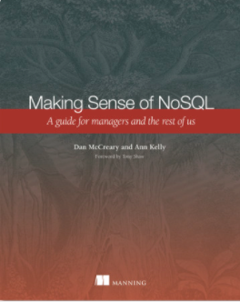

# Books By Dan McCreary

## Making Sense of NoSQL

<figure markdown>
  { width="300" }
  <figcaption>Making Sense of NoSQL</figcaption>
</figure>

[Link to Manning Web Site](https://www.manning.com/books/making-sense-of-nosql)

## State of Healthcare Technology

<figure markdown>
  { width="300" }
  <figcaption>State of Healthcare Technology</figcaption>
</figure>

[Link to Optum Web Site](https://www.optum.com/business/resources/library/oreilly-report.html)

## XQuery

[Link to XQuery Wikibook](https://en.wikibooks.org/wiki/XQuery)

## XForms

[Link to XForms Wikibook](https://en.wikibooks.org/wiki/XForms)

## XRX

[Link to XRX Wikibook](https://en.wikibooks.org/wiki/XRX)