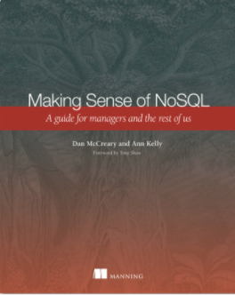

# Dan McCreary NoSQL Resources

## Our Book: Making Sense of NoSQL

[Making Sense of NoSQL (Manning Site)](https://www.manning.com/books/making-sense-of-nosql)

This is a book I wrote with Ann Kelly.  It got very good reviews and I feel that the patterns we identified in this book will be relevant for many years to come. 

## Chapters:

1. NoSQL: It's about making intelligence choices
2. NoSQL concepts
3. Foundational data architecture patterns
    1. Relational
    2. Analytical (OLAP)
    3. Key-Value Stores
    4. Column-Family Stores
    5. Graph
    6. Document
4. NoSQL architecture patterns
5. Native XML databases
6. Using NoSQL to manage big data
7. Finding information with NoSQL search
8. Building high-availability solutions with NoSQL
9. Increasing agility with NoSQL
10. NoSQL and functional programming
11. Security: protecting data in your NoSQL solution
12. Selecting the right NoSQL solution

## Videos

[MACC Video 2014](https://www.youtube.com/watch?v=9slpA72_yHU)

[2013 Dataversity Video](https://youtu.be/Ms4dHPgNPUQ)

[NoSQL Now! NoSQL Architecture Patterns June 2013](https://www.youtube.com/watch?v=RSJUcrY4zhY)

## NoSQL Classes

### NoSQL 101 – Part One

[NoSQL 101 – Part One](http://www.dataversity.net/nosql-101/#)

## Webinar: The CIO's Guide to NoSQL

[Dataversity Webinar: The CIO's Guide to NoSQL July 2012](https://www.dataversity.net/webinar-the-cios-guide-to-nosql-2/)

This webinar is an overview of the NoSQL movement with a focus on the business benefits of NoSQL Systems.  Here are some of the topics we will cover:

1. What is NoSQL?
1. What Triggered the NoSQL Movement?
1. How is NoSQL distinct from Big Data and Cloud Computing?
1. Common Characteristics of NoSQL System
1. Business Benefits of NoSQL
1. Core NoSQL Concepts
1. Selected NoSQL Implementations
1. Recent NoSQL Developments
1. NoSQL Case Study
1. ATAM: An Objective Process for Selecting the Right NoSQL System
1. Next Step: Selecting the Right NoSQL Pilot Project

## Webinar: The National Information Exchange Model and Semantic-Driven Development
Recorded April 14, 2010, 11:00AM

[The National Information Exchange Model and Semantic-Driven Development](https://www.dataversity.net/the-national-information-exchange-model-and-semantic-driven-development/)

Since 2002, several US federal agencies have been deploying XML standards for the exchange of complex data sets. Led by a large project at the US Department of Justice and homeland security, there are now hundreds of states and vendors supporting an emerging XML standard called the National Information Exchange Model or NIEM. This presentation will look at the NIEM processes and show how they are being used to promote semantically precise data exchanges as well as promoting transparency in government. We will compare ISO-based NIEM processes with RDF and OWL and show how they complement each other.