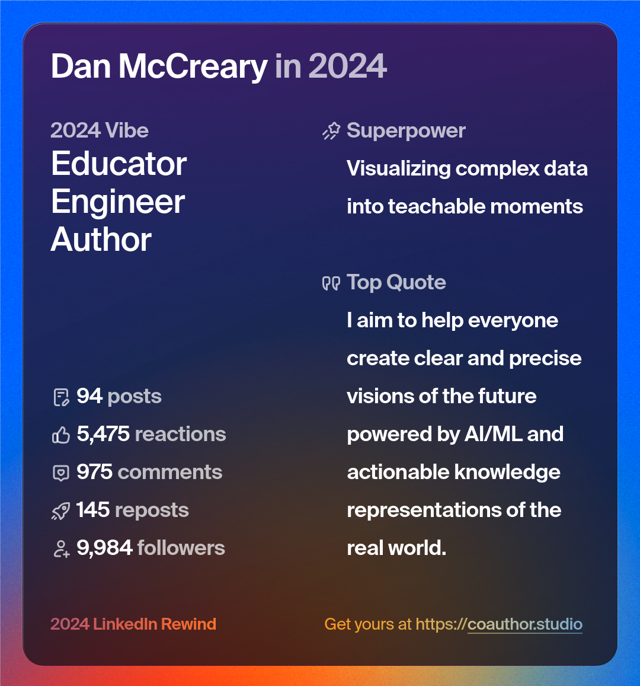

# Resume for Dan McCreary

## Retired AI Researcher | Solution Architect | Author | Keynote Speaker

*Retired AI Researcher working in helping educational organizations
embrace AI and intelligent textbooks*

### Looking for Partners

Dan is looking for partners that are interested in
using AI in education.  Dan believes that by combining
precise learning graphs with AI that personalized intelligent textbooks
can have huge impact on education.

### About Dan

Dan is a seasoned **Solution Architect** with a profound background in **Knowledge Representation for AI**. Dan has extensive experience in building the world’s largest **Enterprise Knowledge Graphs** for integrated member, customer, provider and patient records. Dan is passionate about helping organizations create precise, scalable models above tens of billions of vertices. My personal mission is to assist individuals and organizations in performing objective solution architecture analysis through the art of **storytelling**.

Dan has a unique skill.  He can clearly **visualize how data moves** through hardware, through networks, through databases, and through software applications. Dan can "see" data movement from the lowest chip level all the way up through complex application stacks.  This visual thinking skill allows him to quickly understand the fitness of knowledge representations to business problems.
The ability to see entire systems at work gives Dan a unique [Systems Thinking](https://dmccreary.github.io/graph-systems-thinking/) perspective on problem solving
and architecture tradeoff analysis.

### Experience

- Graph Database
- AI and Machine Learning
- Generative AI and Large-Language Models
- Databases and NoSQL Technologies (Book Author)
- Metadata and Semantics
- NoSQL Architecture Tradeoffs Analysis Methods
- Taxonomies and Ontologies
- Natural Language Processing (NLP)
- AI Hardware and Graph Accelerator Hardware
- Scale-out graph algorithms
- FPGAs and Complex Memory Management Systems
- Systems Thinking and Complex Adaptive Systems

### Recent Achievements

- Leader of the Optum Generative AI Center of Excellence
- Leader in building the world's largest healthcare knowledge graph (over 25 billion vertices)
- Champion of semantic search and ontology management (patent holder)
- Co-author of the highly-rated book "**Making Sense of NoSQL**" [https://www.manning.com/books/making-sense-of-nosql](https://www.manning.com/books/making-sense-of-nosql)
- Thought leader for the adoption of Enterprise Knowledge Graphs
- Founder of the [**NoSQL Now!**](https://www.dataversity.net/tag/nosql-now/) conference (now part of Dataversity)
- Speaker at AI Hardware and advanced memory management conferences

## LinkedIn 2024 Highlights

### Keynote Speaker

Dan has been a keynote speaker at several prestigious technology conferences, spreading insights and thought leadership on AI, enterprise knowledge graphs, and advanced technology solutions.

### Passion for Systems Thinking

**Systems Thinking** and **Complex Adaptive Systems** are not just principles Dan works with, but they are the lenses through which he views the world. Dan is deeply invested in exploring the interconnections and interactions that govern large complex systems and he loves elucidating these complex phenomena.

### Education

* **High School** - Washburn High School, Minneapolis, MN
* **BA** - Carleton College - Physics and Computer Science, Northfield MN
* **MSEE** - University of Minnesota
* **MBA** - University of St. Thomas - 33 of 36 credits done (a work in progress)

### Blog

- **Blog:** [https://dmccreary.medium.com/](https://dmccreary.medium.com/)

### Volunteer Work

Dan is an active volunteer using AI and knowledge graphs to help promote education.  He has volunteered for organizations such as [Code Savvy](https://www.codesavvy.org/) and [Coder Dojo](https://coderdojo.com/).  Dan
also maintains the popular [MicroPython for Kids](https://www.coderdojotc.org/micropython/) as well as several other [STEM](./stem.md) projects.

### Contact Information

- **LinkedIn:** [https://www.linkedin.com/in/danmccreary/](https://www.linkedin.com/in/danmccreary/)

*Last Updated: November 2023*
